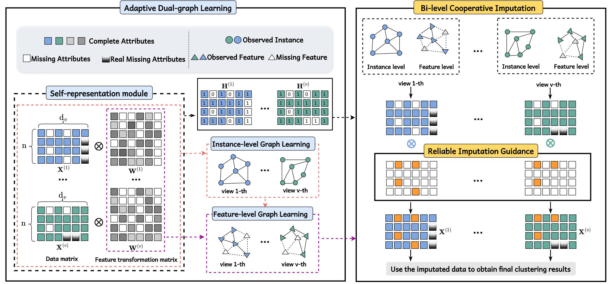

# RAM-MVC: Reliable Attribute-Missing Multi-View Clustering

[](https://www.mathworks.com/products/matlab.html)
[](https://2024.acmmm.org/)
[](https://opensource.org/licenses/MIT)

## 📖 Overview

**RAM-MVC** is a novel **Reliable Attribute-Missing Multi-View Clustering** framework featuring Instance-Level and Feature-Level Cooperative Imputation.

Multi-view clustering (MVC) often faces challenges due to limitations in data collection, specifically **missing attributes**. While existing methods primarily focus on missing instances, they often overlook the synergistic effects between instance and feature spaces when addressing missing attributes. Furthermore, treating all missing values indiscriminately as zeros can lead to **data over-imputation**.

To mitigate these challenges, **RAM-MVC** introduces:
1.  **Cooperative Imputation:** Simultaneously constructs similarity graphs within both instance and feature spaces to learn a high-quality feature reconstruction matrix.
2.  **Reliable Imputation Guidance Module:** Distinguishes between "real" and "technical" zeroes to enable discriminative and accurate imputation.

Extensive experiments on real-world single-cell multi-view data demonstrate that RAM-MVC significantly outperforms existing baseline methods.

### Model Framework


> **Paper:** This work was accepted by *The 32nd ACM International Conference on Multimedia (ACM MM 2024)*.

---

## 🛠 Requirements

To run this project, you need a working installation of MATLAB.

* **MATLAB** (Recommended: R2018b or later)
* **OS**: Windows, Linux, or macOS

---

## 🚀 Usage

### 1. Setup
Clone the repository and navigate to the project folder in MATLAB.

### 2. Execution
To reproduce the results, simply execute the `run.m` script in the MATLAB Command Window:

```matlab
run run.m
````

The script will automatically load the data, perform the RAM-MVC clustering process, and output the evaluation metrics.

-----

## 📧 Contact

If you have any questions about the code or the paper, please feel free to contact:

**Dayu Hu**
Email: [hudy@bmie.neu.edu.cn](mailto:hudy@bmie.neu.edu.cn)

-----

## 📝 Citation

If you find **RAM-MVC** useful for your research, please consider citing our paper:

**Text:**

> Hu, D., Liu, S., Wang, J., Zhang, J., Wang, S., Hu, X., Zhu, X., Tang, C., & Liu, X. (2024). Reliable Attribute-missing Multi-view Clustering with Instance-level and feature-level Cooperative Imputation. In *Proceedings of the 32nd ACM International Conference on Multimedia* (pp. 1456–1466).

**BibTeX:**

```bibtex
@inproceedings{RAMMVC,
  title={Reliable Attribute-missing Multi-view Clustering with Instance-level and feature-level Cooperative Imputation},
  author={Hu, Dayu and Liu, Suyuan and Wang, Jun and Zhang, Junpu and Wang, Siwei and Hu, Xingchen and Zhu, Xinzhong and Tang, Chang and Liu, Xinwang},
  booktitle={Proceedings of the 32nd ACM International Conference on Multimedia},
  pages={1456--1466},
  year={2024}
}
```

```
```
